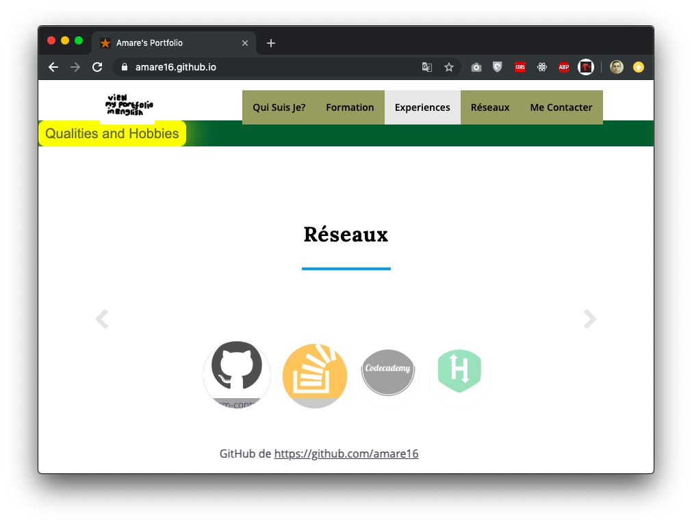
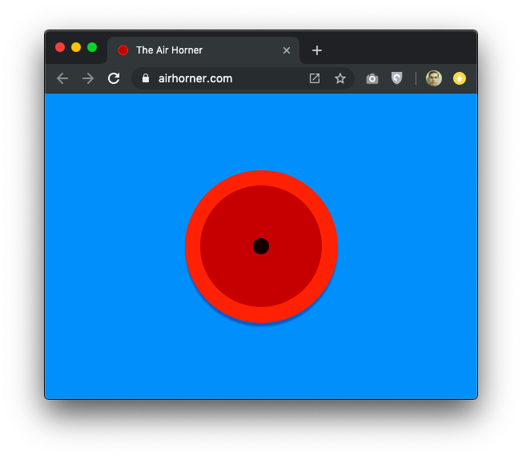
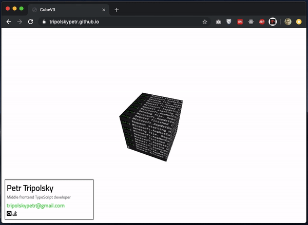
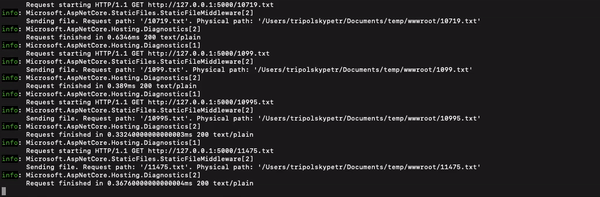
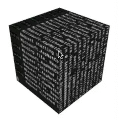

# Programmer CV

> В каждой шутке есть доля шутки...

## Обзор рынка портфолио

На текущий момент крайне сложно сделать выделяющееся из серой массы портфолио для [Github Pages](https://pages.github.com/). Это связано с тем, что чуть менее 100% программистов выкладывают туда статический веб-сайт, сверстанный c применением [Bootstrap](https://getbootstrap.com/). Мною не были найдены годные руководства по созданию оного для людей не креативных.



Более того, некоторые [индивиды](https://github.com/simplonco/portfolio#montreuil---promo-5) практикуют вредные советы и ставят подобные поделки в пример хорошей работы. Нет, это не хорошая работа. Это отвратительно.

## Критерии годного портфолио

После продолжительного раздумья мною были выдвинуты следующие критерии идеальной работы.

 - Компактность :dancers:

    Никто не любит вчитываться - весьма вероятно, что ваш lorem ipsum не оценят. Собственно говоря, этим грешат все лэндинги на Bootstrap: они перегружены контентом.

 - Современность :office:

    Знанием HTML более никого не удивишь: его освоили абсолютно все. Поэтому, в обязательном порядке должны фигурировать React, TypeScript, Babel и другие модные слова, значение которых маловероятно будет познано школьниками

 - Приметность :fireworks:

    Это должно быть что-то залипательное. В пример можно взять следующий PWA: [The Air Horner](https://airhorner.com/). Гугловский сайт,  который предложит установить его как приложение. Без скроллинга. **Один визуальный объект по центру** страницы. Быстро к написанию, просто к просмотру. Залипательно, можно погудеть. Визуально красиво.  Запоминается.

    


## Результат применения критериев

После продолжительной работы, применив вышеперечисленные критерии, у меня вышел такой сайтик. Думаю, задачу продвижения моего личного бренда как разработчика он выполняет. Куб выводит запись лога веб-сервера, куда время от времени приходят запросы на несуществующие ресурсы.



Сайт работает как на мобильных устройствах, так и десктопах. Для удобства запуска без настройки среды разработчика, от был размещен [тут](https://tripolskypetr.github.io/). По возможности, поставьте :star: этому репозиторию, мне будет приятно)

## Использованные инструменты

Для создания куба я применил [THREE.js](https://threejs.org/). Благодаря слою абстракции этот инструмент активно применяет возможности WebGL, что снижает нагрузку на процессор и обеспечивает плавную анимацию, исполняемую на почти всегда простаивающем видеоускорителе. Так же, для обеспечения максимального покрытия браузеров, у него есть [полифилы](https://github.com/mrdoob/three.js/tree/master/examples/js/renderers) для рендеринга.

```
const request = (url, timeout) => new Promise((resolve) => {
    fetch(url).then(() => setTimeout(() => resolve(), timeout));
});
const asyncForEach = async (array, callback) => {
    for (let index = 0; index < array.length; index++) {
        await callback(array[index], index, array);
    }
}
const action = (was) => {
    const arr = ["10138.txt","10719.txt","1099.txt","10995.txt",...];
	  asyncForEach(arr, async (a, index) => {
        if (was === true && index > 10) {
            if (index === 11) {
                await request("done.txt", 0);
            } else {
                return;
            }
        } else if (was !== true && index === (arr.length - 1)) {
            action(true)
        } else {
            const timeout = Math.ceil(Math.random() * 500);
            const prefix = index > 10 ? (Math.round(Math.random() * 3) === 1 ? "1" : "") : "";
            await request(prefix+a, timeout);
        }
    });
}
action();
```

Для создания сурса я написал простенький скрипт, последовательно отправляющий запросы на сервер с разным интервалом. Запросы подавались к веб серверу [Kestrel](https://docs.microsoft.com/en-us/aspnet/core/fundamentals/servers/kestrel?view=aspnetcore-3.0), лог которого в консоль достаточно фотогенично. 



Далее, используя этот [скрипт](./util/build_texture.py) opencv-python я сделал анимированный спрайт для каждой грани куба. После дело было за малым: немного математики:

Координаты углов куба следующие:

{ (0, 0, 0), (0, 0, 140), (0, 140, 0), (0, 140, 140), (140, 0, 0), (140, 0, 140), (140, 140, 0), (140, 140, 140) }


Камера всегда смотрит на точку (0, 0, 0) и катается по следующей плоскости:

x/240 + y/240 + z/240 = 1

##  Гифка с кубом



В результате работы получилась некая *кубическая консоль*, которая меняет свой наклон исходя из положения мыши на странице. Посмотреть с браузера можно по [ссылке](https://tripolskypetr.github.io/).
